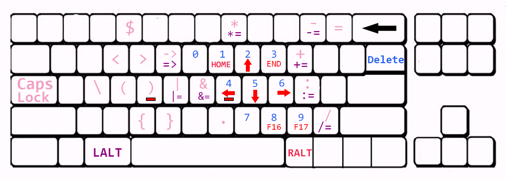

# remap_capslock_ralt

An **[AutoHotKey](https://www.autohotkey.com/docs/misc/Remap.htm)** script that optimizing keymap for **programming** 

The script remaps **Capslock** and **Right ALT** to make them funciton like the modifier keys(ctrl, shift).

## USAGE

CapsLock + keys: send **operators** and **numbers** (pink and blue ones) 
CapsLock + LALT + keys: send **assignment operators** (purple ones) 

RALT + keys: send **arrow keys** and **custom commands** (red)

Double-tap CapsLock to turn CAPITALIZATION ON, single tab to turn it off.

*Remember to run the script as **administrator**  otherwise the script won't work on programs with elevated privilege. You could also set up a scheduled task to automatically start the script(.exe file) at startup.
